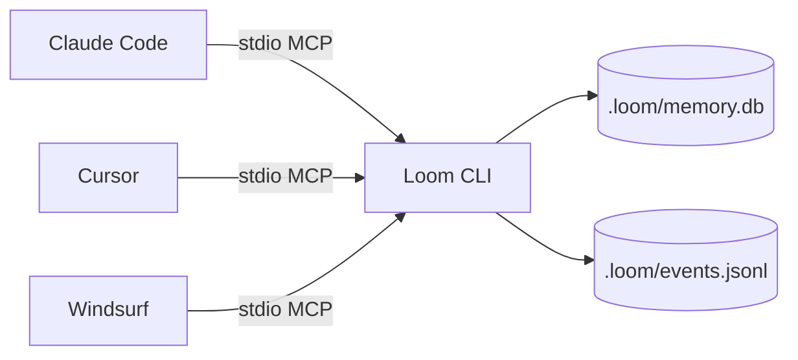
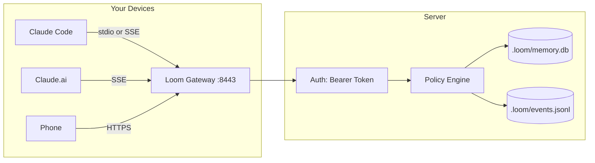
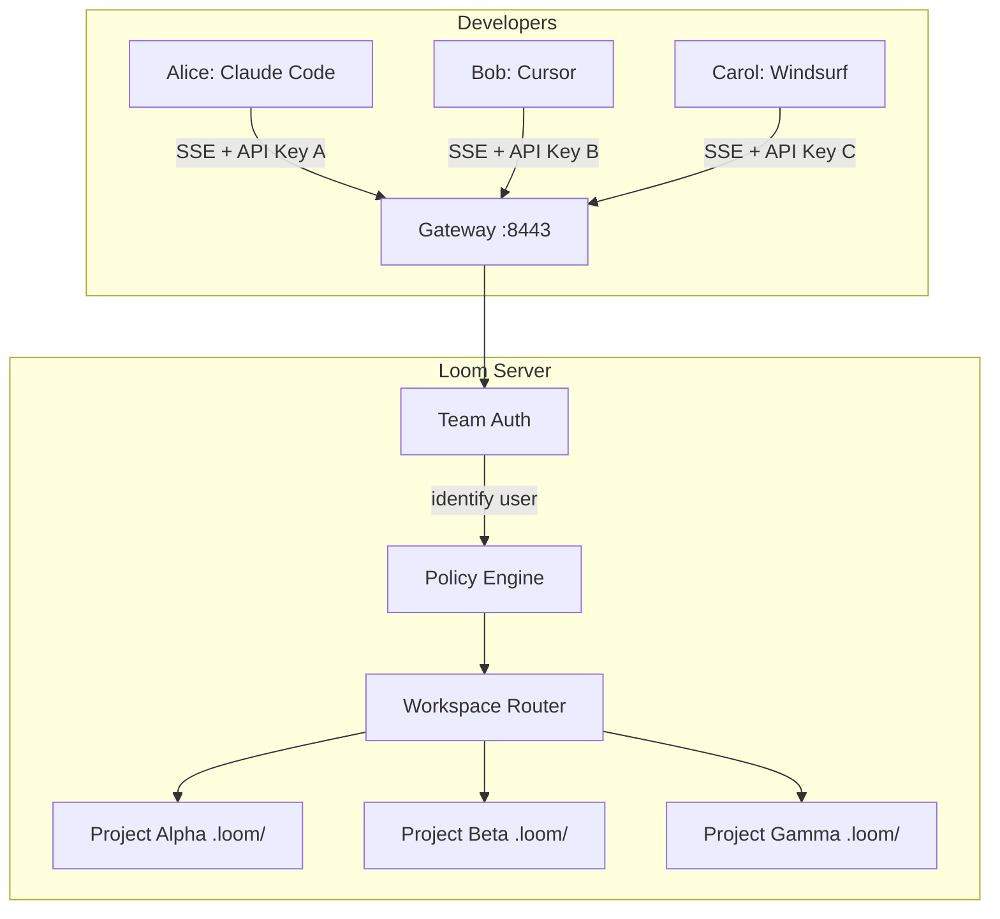
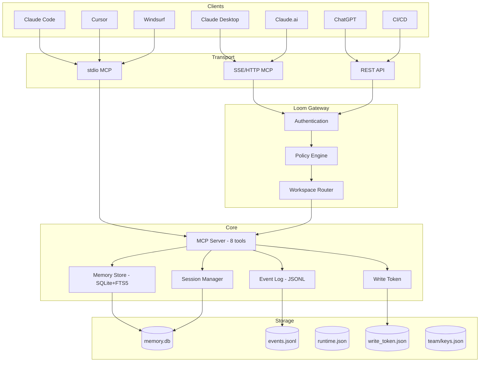
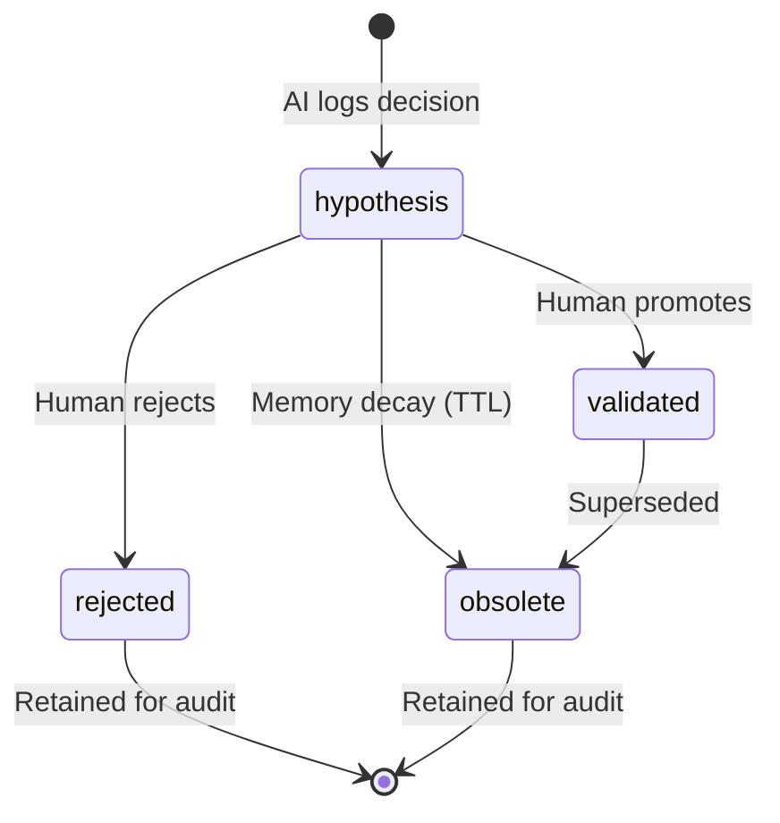
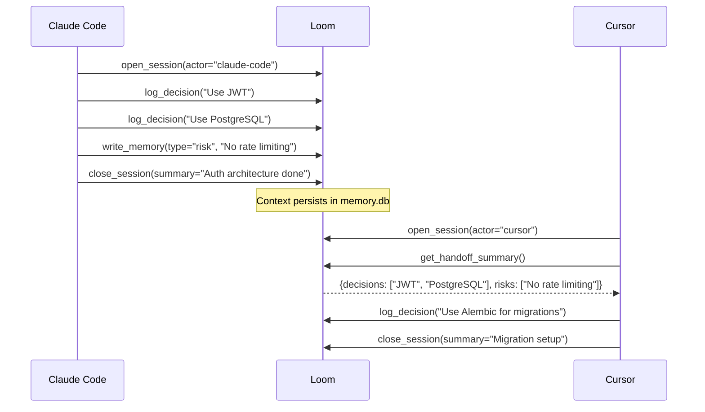
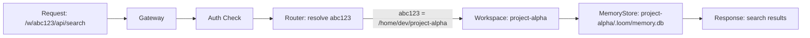
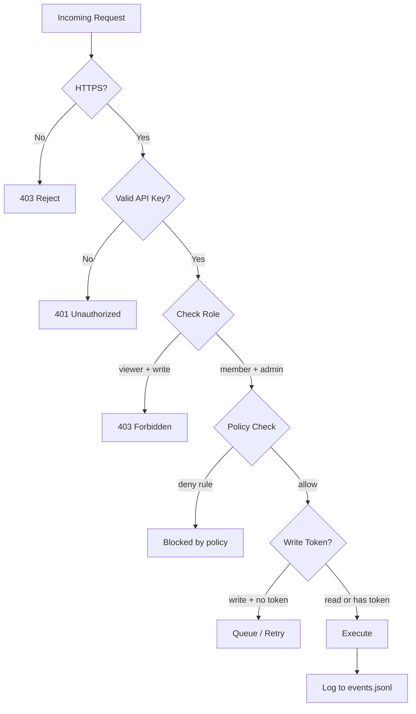

# Loom Architecture

## Deployment Modes

Loom supports three deployment modes. Pick the one that matches your team size and workflow.

### Mode 1: Solo Offline (default)

Everything runs on your machine. No server, no network, no auth.



**When to use:** Solo developer, single machine, privacy-first.

| Aspect | Detail |
|--------|--------|
| Setup | `pip install loom && loom init && loom connect claude-code` |
| Auth | None needed |
| Network | None |
| Data location | Local filesystem (`.loom/`) |
| Concurrent users | 1 |
| Multi-workspace | Switch with `cd` — each project has its own `.loom/` |

### Mode 2: Solo Connected (remote gateway)

Loom runs on a server. You access it from any device, any AI tool.



**When to use:** Solo developer, multiple devices, access from Claude.ai or ChatGPT.

| Aspect | Detail |
|--------|--------|
| Setup | `loom gateway start` on a VPS + `loom connect --remote` on devices |
| Auth | Single API key (`LOOM_API_KEY`) |
| Network | HTTPS required |
| Data location | Server filesystem |
| Concurrent users | 1 (but from any device) |
| Multi-workspace | One gateway = one workspace. Use multi-workspace mode for multiple projects. |

### Mode 3: Small Team (shared server)

Multiple developers share one Loom server. Each gets their own API key.



**When to use:** Team of 3-10 developers, shared project memory, audit trail.

| Aspect | Detail |
|--------|--------|
| Setup | `loom team add alice --role admin` + distribute API keys |
| Auth | Per-user API keys with roles (admin/member/viewer) |
| Network | HTTPS required |
| Data location | Server filesystem (one `.loom/` per project) |
| Concurrent users | 3-10 (SQLite WAL) |
| Multi-workspace | `loom workspace register /path/to/project` for each project |

## System Architecture



## Data Flow

### Decision Lifecycle



### Session Flow



### Multi-Workspace Request Routing



## Security Model



## Scaling Limits

| Dimension | Solo | Small Team | Needs Migration |
|-----------|------|------------|-----------------|
| Users | 1 | 3-10 | >20 → PostgreSQL |
| Memory entries | <10K | <10K | >100K → archiving |
| Search latency | <0.1ms p95 | <1ms p95 | >10ms → index tuning |
| Workspaces | 1 per CLI | 1-10 per server | >10 → separate instances |
| Storage | Local SSD | Server SSD | >10GB → S3/NFS |
| Auth | None / single key | Per-user keys | SSO → V2.0 |
| Audit | events.jsonl | events.jsonl | Signed log → V2.0 |

## Migration Path

```
V0.x (current)          V1.0                    V2.0
─────────────           ────                    ────
SQLite + files    →     SQLite + contracts  →   PostgreSQL option
File-based auth   →     API key + roles     →   OAuth2 / SSO
Single-process    →     Gateway + policy    →   Connection pooling
events.jsonl      →     events.jsonl + hash →   Signed audit log
Manual sync       →     Git-based sync      →   Real-time replication
```
