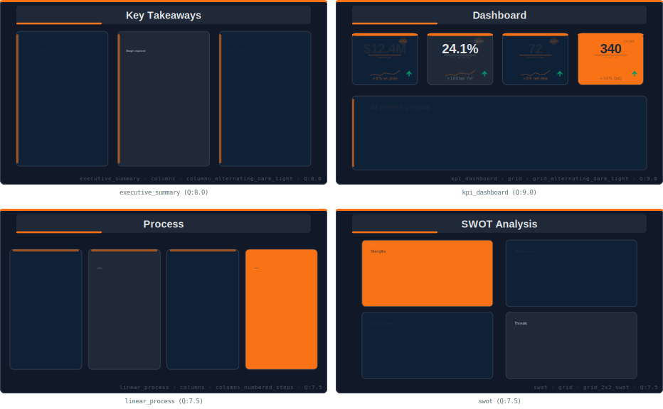

<div align="center">

# PISA — Presentation Intelligence & Slide Architecture

**Analyze, generate, retheme, and review professional PowerPoint decks.**

[](references/pisa-schema-v2.1.md)
[](registry/)
[](registry/styles/)
[](registry/personas/)
[](docs/gallery.md)

</div>

### Preview — Corporate Essentials Pack (dark theme)

<p align="center">
  
</p>

> 61 templates across 4 packs. Each template is a reusable slide structure — fill with your content, style with your theme, shape with your persona. [Browse the full gallery →](docs/gallery.md)

---

## The Core Idea

PISA produces professional slides through 4 independent layers:

```
Canvas  ×  Style  =  Template              ← what you browse & pick
Template  ×  Theme  ×  Persona  ×  Content  =  Final Slide  ← what gets rendered
```

| Layer | What it controls | Example |
|-------|-----------------|---------|
| **Canvas** | Structure — what components exist and where they sit | "Title top, 4 KPI cards in a grid, body below" |
| **Style** | Visual personality — card backgrounds, accents, spacing, shadows | Bold, Minimal, Gradient, Split, Photo |
| **Template** | Canvas + Style pre-combined — the browsable, installable artifact | `ce_kpi4` in the corporate pack |
| **Theme** | Colors and fonts — brand palette applied at render time | Corporate Dark, Finance Dark |
| **Persona** | Communication density — word count, bullets, narrative framework | Executive (60 words), Strategy (90 words) |

**Why this matters:** swap any layer without touching the others. Same template in bold style → switch to minimal. Same template in corporate dark → switch to finance. Same template for executives → switch to strategy consultants.

---

## Showcase

Every template is a reusable slide structure. Install a pack, fill with your content, apply any theme.

**[Browse all 61 templates →](docs/showcase.md)**

<table><tr>
<td width="33%"><br><sub>KPI Dashboard · dark/light/accent</sub></td>
<td width="33%"><br><sub>Finance KPI Grid · 6 cards</sub></td>
<td width="33%"><br><sub>Strategy KPIs · data-rich</sub></td>
</tr><tr>
<td width="33%"><br><sub>Executive Summary · 3 columns</sub></td>
<td width="33%"><br><sub>Process · numbered steps</sub></td>
<td width="33%"><br><sub>Impact-Effort Matrix</sub></td>
</tr><tr>
<td width="33%"><br><sub>Startup Traction · KPIs + chart</sub></td>
<td width="33%"><br><sub>SWOT · colored quadrants</sub></td>
<td width="33%"><br><sub>Funnel · narrowing stages</sub></td>
</tr></table>
- **Share templates** → teams reuse proven layouts across projects

## Quick Start

1. Download [`SKILL.md`](SKILL.md) and add it to a Claude Project
2. Connect the registry:
   ```
   Use my PISA registry at
   https://raw.githubusercontent.com/NeimadLab/claude-skills/main/skills/pisa/registry/registry.json
   ```
3. Install a pack: `"Install the corporate essentials pack"`
4. Create: `"Build a 10-slide Q3 review using the executive persona"`

## What You Can Do

| Capability | How |
|-----------|-----|
| **Analyze any deck** | Upload PPTX, PDF, or screenshot → decompose into V2.1 templates |
| **Generate slides** | Describe your deck → select templates → render PPTX |
| **Retheme instantly** | Swap one JSON → entire deck changes appearance |
| **Review and score** | Programmatic QA + 5-dimension rubric |
| **Browse catalog** | SVG previews inline, filter by intent, compare themes |
| **Install from registry** | One command loads a pack from this repo |

## Eight Personas

| Persona | Archetype | Words/Slide | Key Rule |
|---------|-----------|:-----------:|----------|
| `strategy` | McKinsey / BCG | 90 | Insight titles. 40%+ data slides. |
| `executive` | Board / C-Suite | 60 | 4–8 slides. Elevator test. |
| `keynote` | TED / Conference | 25 | One idea per slide. No bullets. |
| `startup` | Seed / Series A | 50 | Problem → Solution → Ask. |
| `technical` | Architecture | 80 | Diagrams first. Monospace for code. |
| `sales` | Pitch / Proposal | 65 | Benefit-led titles. Social proof. |
| `workshop` | Training | 70 | Learning objectives. Numbered steps. |
| `academic` | Conference | 75 | Citations required. Error bars. |

## Schema V2.1

Every slide decomposes into a template JSON with:

- **`kpi{}`** — value, unit (superscript/suffix), label, annotation, trend
- **`visual{}`** — bg_variant (dark/light), borders, icon hints, shape
- **`content_data{}`** — timeline entries, org charts, checklists (not flattened to text)
- **`zones[]`** — compound slides with multiple intents mapped to spatial regions

[Full schema reference →](references/pisa-schema-v2.1.md)

## Registry

| Pack | Templates | Install |
|------|:---------:|---------|
| Corporate Essentials | 24 | `Install corporate essentials` |
| Finance & Reporting | 14 | `Install finance reporting` |
| Strategy Consulting | 12 | `Install strategy consulting` |
| Startup Pitch | 11 | `Install startup pitch` |

3 themes, 5 styles, and 8 personas available.

## Directory Structure

```
skills/pisa/
├── SKILL.md                ← Drop this into Claude
├── services/
│   ├── extraction/         ← XML parsing engine (python-pptx)
│   ├── svg/                ← SVG template preview renderer
│   ├── qa/                 ← Programmatic QA (10 checks)
│   └── generator/          ← Template + theme + content → PPTX
├── references/             ← Schema, personas, architecture
├── scripts/                ← Bootstrap for Tier 2
├── registry/
│   ├── packs/              ← Template packs by domain
│   ├── themes/             ← Color/font palettes
│   ├── styles/             ← Visual personality rules (bold, minimal, gradient...)
│   └── personas/           ← Communication density profiles
└── docs/                   ← Guide, showcase gallery, Pages content
```

**Everything is self-contained.** This folder has no dependencies on anything outside it.

## Contributing to PISA

See [CONTRIBUTING.md](CONTRIBUTING.md) for pack quality requirements, theme token specs, and persona format.

See [ROADMAP.md](ROADMAP.md) for what's planned and where to contribute.
