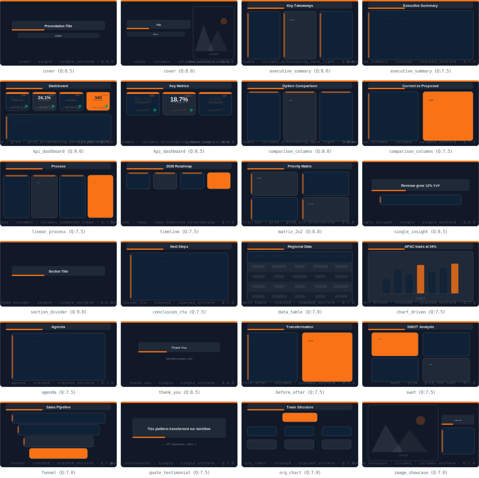
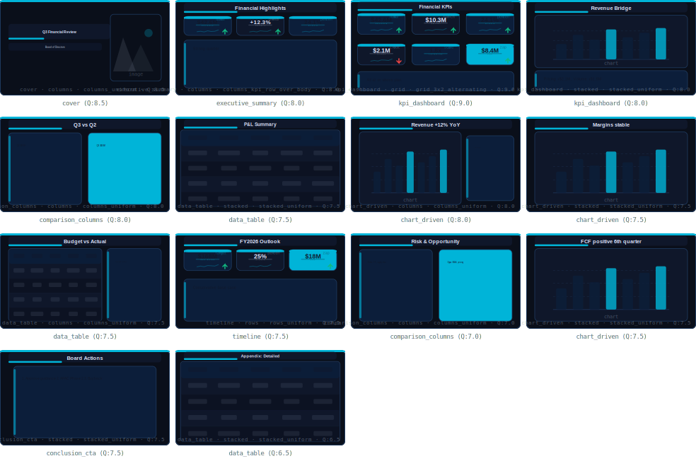
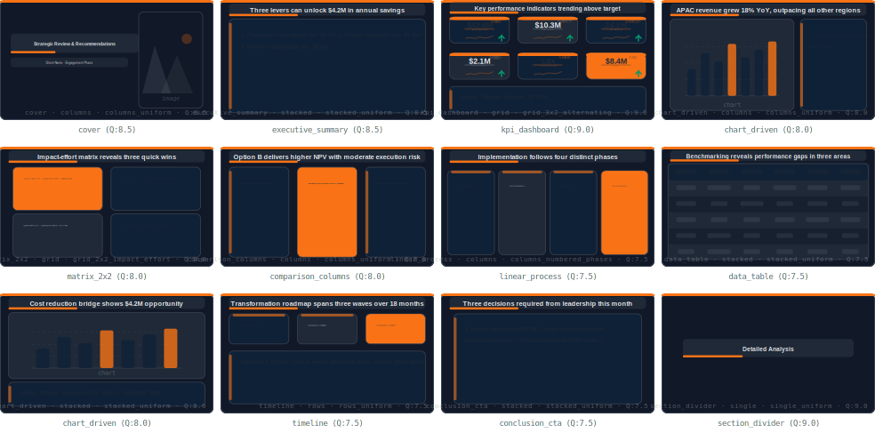
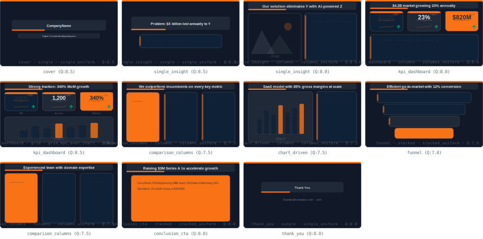

# Template Gallery

Visual catalog of every template available in the PISA registry. Each template is a reusable slide structure that gets filled with your content, styled by your theme, and shaped by your persona.

> These are SVG previews rendered by the PISA engine. In Claude, say `"Show me all KPI templates"` to browse interactively.

---

## Corporate Essentials — 24 templates

Full 21-intent coverage. The default starting pack.



**Intents covered:** cover (2), executive_summary (2), kpi_dashboard (2), comparison_columns (2), linear_process, timeline, matrix_2x2, single_insight, section_divider, conclusion_cta, data_table, chart_driven, agenda, thank_you, before_after, swot, funnel, quote_testimonial, org_chart, image_showcase

---

## Finance & Reporting — 14 templates

CFO decks, quarterly reviews, investor updates. Includes the `finance_dark` theme with blue/cyan palette.



**Intents covered:** cover, executive_summary, kpi_dashboard (2), comparison_columns (2), data_table (3), chart_driven (3), timeline, conclusion_cta

---

## Strategy Consulting — 12 templates

McKinsey/BCG-style deliverables. Insight-driven titles, source citations, impact-effort matrices.



**Intents covered:** cover, executive_summary, kpi_dashboard, chart_driven (2), matrix_2x2, comparison_columns, linear_process, data_table, timeline, conclusion_cta, section_divider

---

## Startup Pitch — 11 templates

Investor pitch decks. Problem→Solution→Market→Traction→Team→Ask narrative.



**Intents covered:** cover, single_insight (2), kpi_dashboard (2), comparison_columns (2), chart_driven, funnel, conclusion_cta, thank_you

---

## How to install

In any Claude Project with PISA loaded:

```
Install the corporate essentials pack
```

```
Install the finance reporting pack
```

Mix and match — install multiple packs, your library merges them.

---

## How templates work

A template defines **structure** — intent, layout, component positions, visual treatment. Three things transform it at runtime:

| Layer | What it controls | Example |
|-------|-----------------|---------|
| **Theme** | Colors, fonts, spacing, accent style | `corporate_dark` → dark bg, orange accents |
| **Persona** | Density, narrative, title style | `executive` → 60 words max, SCR framework |
| **Content** | Your actual text, data, images | "Revenue grew 23% driven by APAC expansion" |

Same template + different theme = different look. Same template + different persona = different density. Same template + different content = different deck.
